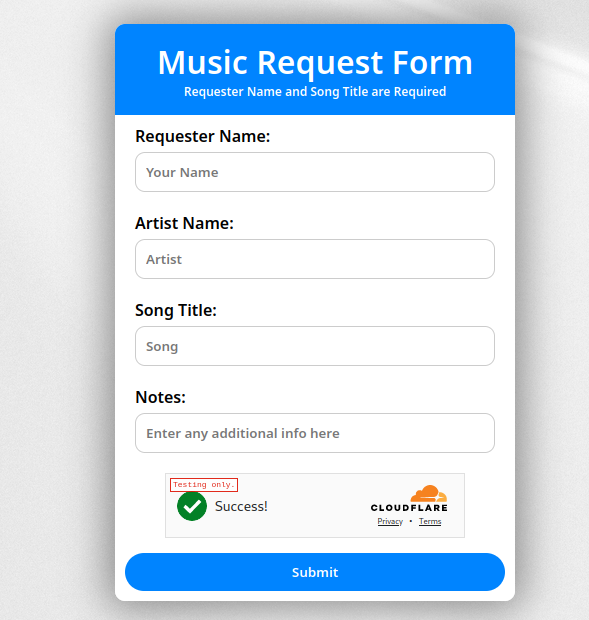

This is my new song request site built to connect to any SMTP server using PHPMailer.
PHPMailer is not inclued in this repo to download and place where the code expectes you can run the following


# Using A Website for DJ Song Requests
This repostory contains PHP code that takes song requests and them using using the configured SMTP server located in the index.php file.

**PHPMailer is not inclued.**




## Why PHP?

Orignally I was using cloudflare workers with mail channnels but that is no longer a thing. So I pivoted to using Amaozon SES though by leaving it open ended you can switch to any other providers without a code re-write.

## How do I setup the website?

1. You will need to place the files on a server with a PHP web server running on it.
1. Download PHPMailer and place the files from the latest release in phpmailer/ or run the following command (jq required)
```bash
latest_release=$(curl -s https://api.github.com/repos/PHPMailer/PHPMailer/releases/latest | jq -r .tag_name) && wget https://github.com/PHPMailer/PHPMailer/archive/refs/tags/${latest_release}.zip && unzip ${latest_release}.zip -d phpmailer/ && cp -R phpmailer/PHPMailer-*/* phpmailer/ && rm -R phpmailer/PHPMailer-* ${latest_release}.zip
```
1. Edit the defines in the index.php file with the secrest key for cloudflare turnstile and the SMTP configuration.
1. Add the site key for cloudflare turnstile to form.html

## Taking it to the next level
Now if you send the message to an alias setup via [SimpleLogin](https://simplelogin.io) you can control if messages make it to the DJ by turning the off or on as neeeded. 

So you can make sure the DJ doesn't get bothered more than is necessary.  

### SMS Gateway

The phone carriers offer SMS to Email Gateways meaning we can then have SimpleLogin forward the message to the email address that represents the DJ's Cell Phone. Search [email to sms](https://duckduckgo.com/?q=email+to+sms) as there are many guides on this.

For guests that email or SMS (assuming the phone carrier supports two way) it gives the DJ option of communationg back with them if they desire.

#### Why SMS

Because in low coverage locations it can be hard to even load a webpage. You would be more likley to be able to send and SMS and it's simple.

## So what does this look like?

So if I were to resprent the layers it would look something like this.


| Medium | Path | 
| -------- | -------- |
| Email     | Email <=> to SimpleLogin <=> SMS     |
| SMS     | SMS <=> Email <=> to SimpleLogin <=> SMS     |
| Website     | Website => Email => SimpleLogin => SMS     |


## Why go from sms to email and back again?

1. This allows us to not give out the DJ's Cell Phone Number.
1. This allows us to use something like simple login in the middle where it can easily switched off.

 
## Are there any downsides?

* Relies on Phone cariers email to sms gateways, Cloudflare, MailChannels, and SimpleLogin
* Requires a PHP Web Server
* Requies a bit of technical knoledge to setup
* No custom spam filtering (although simplelogin have there own filtering)

## How do I get the intomation to guests?

I think a vCard in the form of a QR code would be best. This also leaves the opptunity to leave a custom message in the notes of the contact if desired.
